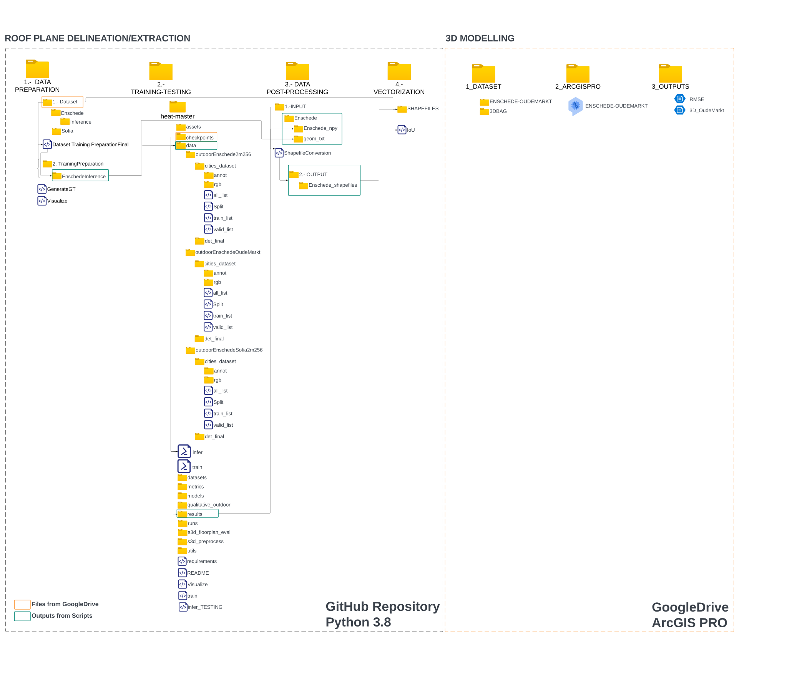
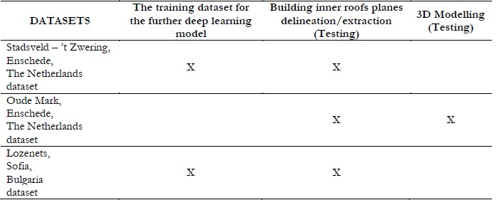
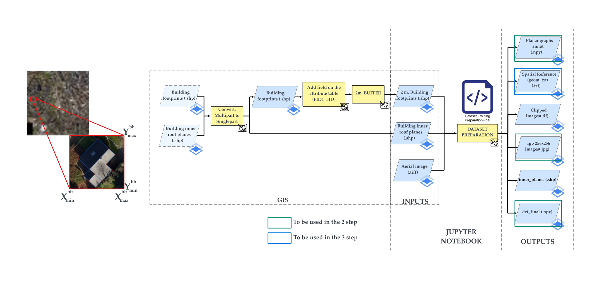
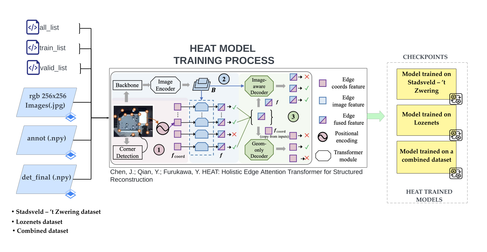
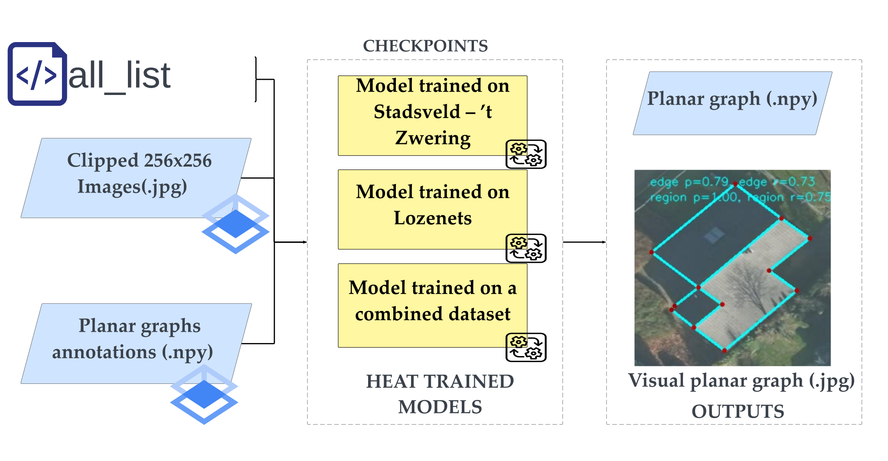
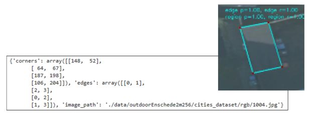
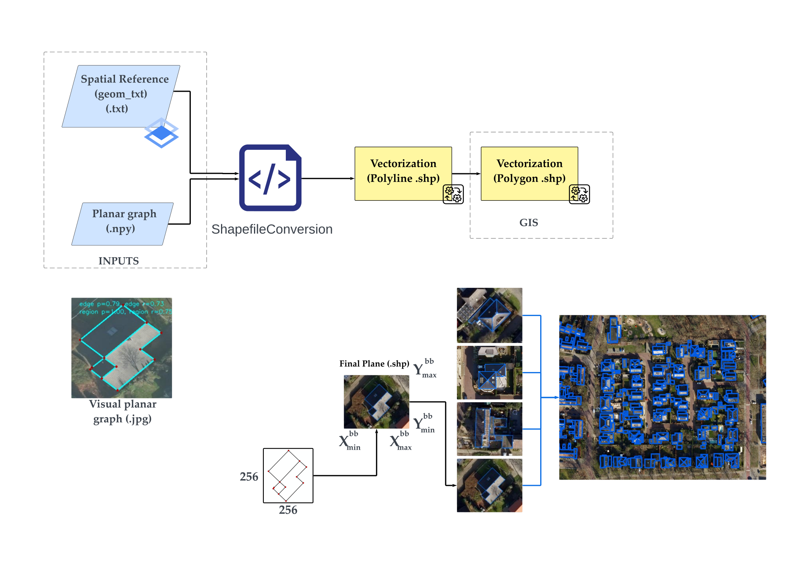
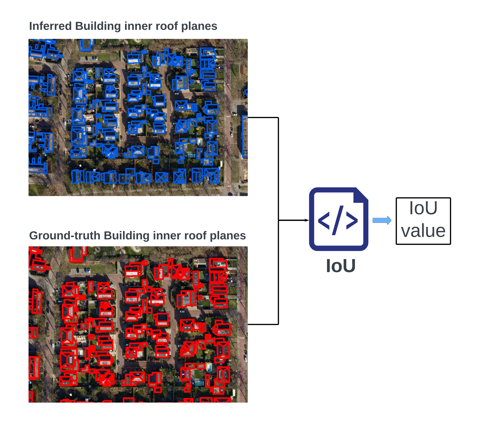

# **Automatic Building Roof Plane Extraction in Urban Environments for 3D Modelling Using Remote Sensing data**

 This repository contains all the  scripts used in the development of the paper: "Automatic Building Roofs Planes Extraction in Urban Environments for 3D Modelling using Remote Sensing Data" (Remote Sensing MDPI, 2024), and the MSc. thesis: [AUTOMATIC BUILDING ROOF PLANE STRUCTURE EXTRACTION FROM REMOTE SENSING DATA FOR LOD2 3D CITY MODELLING](http://essay.utwente.nl/96138/) (ITC-UT, 2023).

Please use the following bib entry to cite the paper if you are using resources from this repo.

```
@article{Campoverde2024AutomaticRoofExtraction,
     title={Automatic Building Roofs Planes extraction in urban environ-ments for 3D modelling using Remote Sensing data},
     author={CCampoverde, Koeva, Persello, Maslov, Jiao, Petrova Antonova},
     booktitle={MDPI Remote Sensing},
     year={2024}
} 
```

If you wish to delve deeper into the details, you can consult the master's thesis, which delved extensively into this research. Please use the following bib entry to cite the MSc. thesis
```
@mastersthesis{campoverde2023automatic,
     title={Automatic building roof plane structure extraction from remote sensing data for lod2 3D city modelling},
     author={Campoverde, Carlos},
     year={2023},
     school={University of Twente}
} 
```
The presented work were developed on the top of the work developed by Chen, 2022 on the paper: [HEAT: Holistic Edge Attention Transformer for Structured Reconstruction](https://github.com/woodfrog/heat).

```
@inproceedings{chen2022heat,
     title={HEAT: Holistic Edge Attention Transformer for Structured Reconstruction},
     author={Chen, Jiacheng and Qian, Yiming and Furukawa, Yasutaka},
     booktitle={IEEE Conference on Computer Vision and Pattern Recognition (CVPR)},
     year={2022}
} 
```
## **Introduction**

This repository introduces a framework for the reconstruction of building inner roof planes in aerial images and the subsequent application of the obtained outputs to generate 3D models at LOD2.

The framework consists of two distinct stages:

1) Stage 1: Roof plane delineation/extraction
2) Stage 2: 3D Modelling


As illustrated in the figure above, the overall framework consists of two stages. For more detailed information, please refer to the paper or the MSc. Thesis.

This repository offers scripts, data, pre-trained HEAT checkpoints for our study areas, and 3D modeling metadata for the developed LOD2 3D model.

---
## **Data structure**
The data structure of both the repository and the entire framework is illustrated in the picture shown below:


---
## **Dataset Download**
Please download the data for the two stages from the links below. 

1) Stage 1. Roof plane delineation/extraction
Extract the data into the 1.- DATA PREPARATION/1.-Dataset

Data:[Link](https://drive.google.com/drive/folders/12AmomRCLc28QwAtFo-9YXQpJq4Q_FTAk?usp=drive_link)


2) Stage 2. 3D Modelling 

Data:[Link](https://drive.google.com/drive/folders/1C0qwlgx6gXsfIcFQd_x9gPT2yih6e-jf?usp=sharing)

## **Checkpoints**
Please download the checkpoints for the different trained models of our study cases from the link below, extract the checpoints into the 2.- TRAINING-TESTING/heat-master/checkpoints


Checkpoints:[Link](https://drive.google.com/drive/folders/1DMv5N5BE8Zcp8gLNU24Ylr9jZSnLxp9V?usp=sharing)


Three study areas were defined, each with three main stages outlined for their use, as shown below.




#### Each script has its own purpose and requirements, and they should be run in the specified sequence of steps to reproduce the results presented in both the paper and the MSc thesis on which the research is based.

## **Environment**

This repository was developed and tested with Jupyter Notebook using Python 3.8. Please ensure to read and install all the requirements needed to use HEAT: Holistic Edge Attention Transformer for Structured Reconstruction.

## **Building  Roof plane delineation/extraction**

This section is available in the presented repository and is organized into four steps.

**1) Data Preparation**

The data preparation process involves various stages, utilizing both GIS and the developed script contained in the '1.-DATA PREPARATION' folder. In this phase, we will create all the input datasets to be used with the HEAT methodology for the next step of the framework. The diagram below illustrates how the data preparation script works, identifying the required inputs and the generated outputs.




**2) Training / Inference**

Training

The training process begins with the use of the HEAT pre-trained model, trained for 800 epochs (0-799) based on the dataset size (1601 building image samples from Paris, Las Vegas, or Atlanta) without hyper-parameter search. Please refer to the HEAT repository. Ensure you review all environmental requirements and libraries necessary to execute the HEAT deep learning method. Follow the data structure diagram to locate all data inputs and dataset requirements.

The training strategy in the current research involves leveraging the prior knowledge of the pre-trained model as a starting point.

The training process yields checkpoints representing the best model during the session based on the validation curve. For each training session, you will obtain both the best model and the last model.



Inference

After obtaining the different trained models, the inference process can be performed. We have included the trained models (checkpoint) for our study cases in the link provided in the checkpoint section.



The model is applied to the predefined testing datasets to delineate the inner roof planes of the building samples. The outputs of this application are recorded in a Python dictionary, as depicted in the figure below.



**3) Post-Processing/Vectorization**

In this step, we will convert the planar graph dictionaries obtained from the inferences. As the delineated buildings' inner roof plane graphs are named with their corresponding input image names, we will use the image file name to map the corresponding polygon bounding box for clipping this image sample from the original aerial image. This information is captured in the spatial reference text file saved in the first step. The figure below illustrates this step.

The shapefile conversion script utilizes the mentioned files to collect all the planar graphs from building samples and the spatial reference files to combine them. The script then generates a singular shapefile in polyline geometry, containing all the reconstructed inner roof planes for the applied study area dataset. The polyline representations of building inner roof planes can be converted into polygon planes using GIS software through conversion operations between geometries.



**4) Vectorization Evaluation**

In this step, Intersection over Union (IoU) is utilized as a vector format evaluation metric for the predicted building inner roof planes (in polygon format). The IoU is calculated by dividing the intersection area by the union area of predicted inner roof planes and ground truth building inner roof planes. This metric assesses the accuracy of the final outputs obtained after extracting and vectorizing all the predicted inner planes of the buildings.



## **3D Modelling**

This section is available in the Google Drive folder accessible through the following [link](https://drive.google.com/drive/folders/1C0qwlgx6gXsfIcFQd_x9gPT2yih6e-jf?usp=sharing).

This stage was performed in ArcGIS Pro, and the developed web map can be found in the following [link](https://arcg.is/1raWvS0)


## **References**

[1]. Chen, J.; Qian, Y.; Furukawa, Y. HEAT: Holistic Edge Attention Transformer for Structured Reconstruction. Proc. IEEE Comput. Soc. Conf. Comput. Vis. Pattern Recognit. 2022, 2022-June, 3856–3865, doi:10.1109/CVPR52688.2022.00384.

[2]. Zhao, W.; Persello, C.; Stein, A. Building Outline Delineation: From Aerial Images to Polygons with an Improved End-to-End Learning Framework. ISPRS J. Photogramm. Remote Sens. 2021, 175, 119–131, doi:10.1016/j.isprsjprs.2021.02.014.

[3]. Zhao, W.; Persello, C.; Stein, A. Extracting Planar Roof Structures from Very High Resolution Images Using Graph Neural Networks. ISPRS J. Photogramm. Remote Sens. 2022, 187, 34–45, doi:10.1016/j.isprsjprs.2022.02.022.

[4]. PDOK (the Public Services On the Map). Available online: https://www.pdok.nl/.