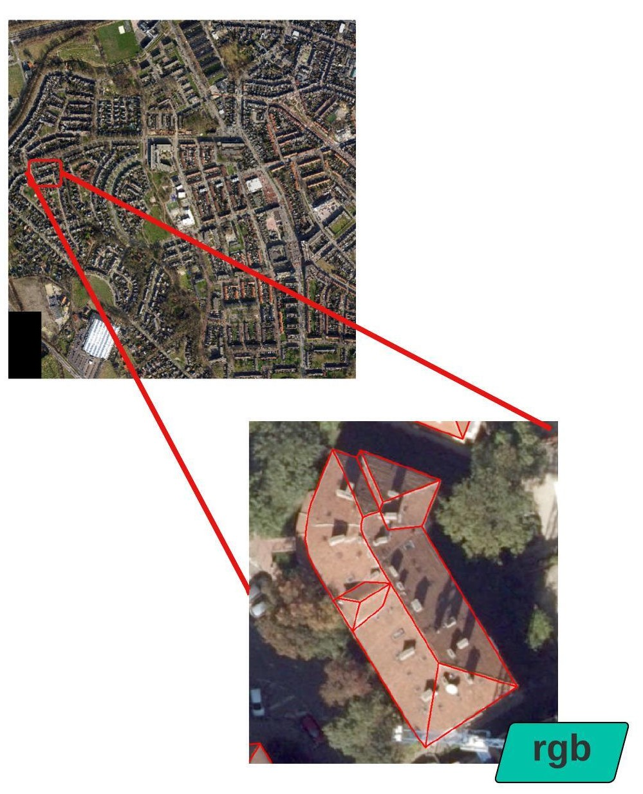
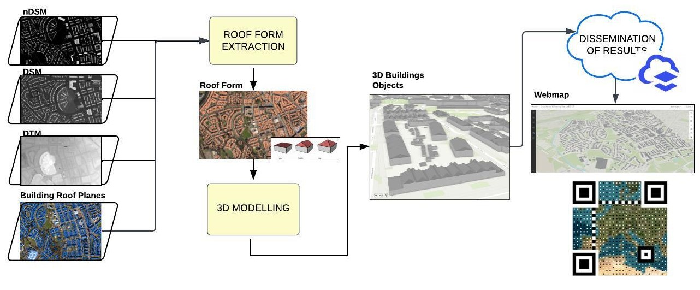
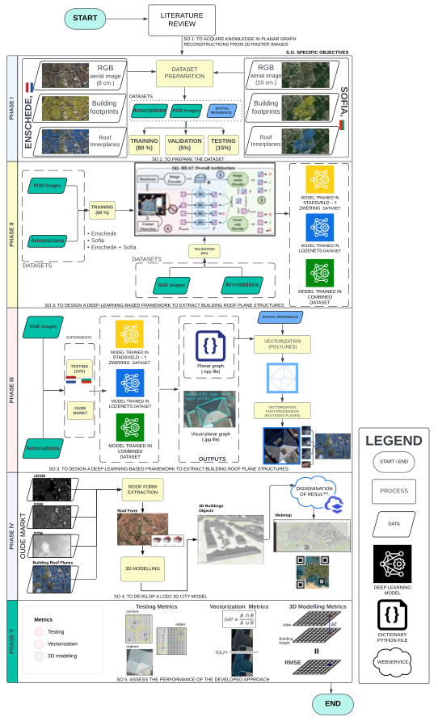

# **Automatic extraction of Building Roofs Planes in urban environments for 3D modelling using Remote Sensing data**

 This repository contains all the  scripts used in the development of the paper: "Automatic extraction of Building Roofs Planes in urban envi-ronments for 3D modelling using Remote Sensing data" ( Remote Sensing MDPI, 2023), and the MSc. thesis: "AUTOMATIC BUILDING ROOF PLANE STRUCTURE EXTRACTION FROM REMOTE SENSING DATA FOR LOD2 3D CITY MODELLING" (ITC-UT, 2023).

 The presented work were developed on the top of the work developed by Chen, 2022 on the paper: HEAT: Holistic Edge Attention Transformer for Structured Reconstruction.

 @inproceedings{chen2022heat,
     title={HEAT: Holistic Edge Attention Transformer for Structured Reconstruction},
     author={Chen, Jiacheng and Qian, Yiming and Furukawa, Yasutaka},
     booktitle={IEEE Conference on Computer Vision and Pattern Recognition (CVPR)},
     year={2022}
} 

---
## **Introduction**
   

This paper focuses on a framework for planar graph reconstruction in outdoor architecture reconstruction from a satellite image in the urban environment for LOD2 3D modelling.

---
## **Method**

#### Each script has its own purpose and requirements and should be run in this sequence of steps to reproduce the results in the MSc thesis:

## **Preparation**

#### Note: The code, data, and pre-trained models in this repo are for non-commercial research purposes only, please check the LICENSE file for details.:

## **Environment**

#### This repo was developed and tested with Jupiter Notebook using Python3.8