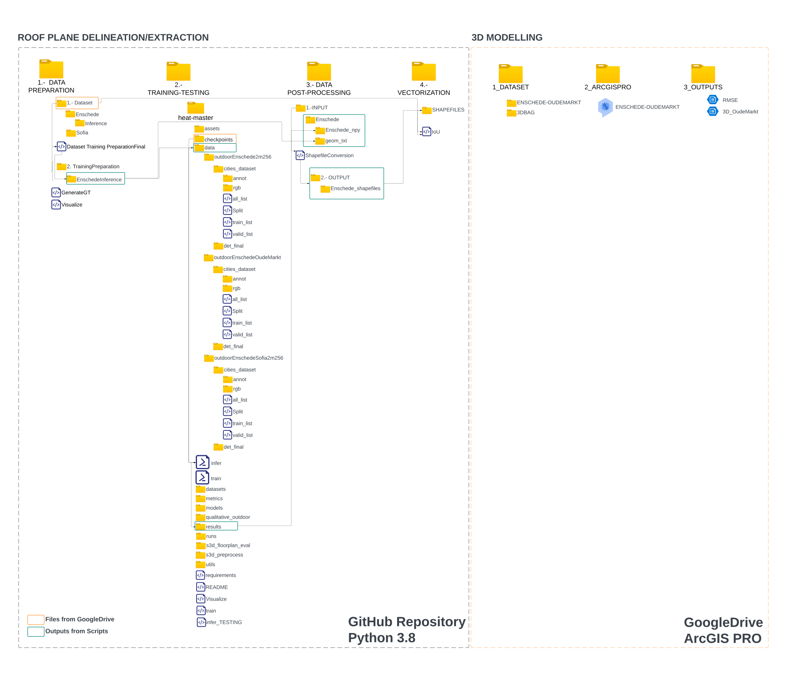

# **Automatic Building Roof Plane Extraction in Urban Environments for 3D Modelling Using Remote Sensing data**

 This repository contains all the  scripts used in the development of the paper: "Automatic Building Roofs Planes Extraction in Urban Environments for 3D Modelling using Remote Sensing Data" (Remote Sensing MDPI, 2024), and the MSc. thesis: [AUTOMATIC BUILDING ROOF PLANE STRUCTURE EXTRACTION FROM REMOTE SENSING DATA FOR LOD2 3D CITY MODELLING](http://essay.utwente.nl/96138/) (ITC-UT, 2023).

Please use the following bib entry to cite the paper if you are using resources from this repo.

```
@article{Campoverde2024AutomaticRoofExtraction,
     title={Automatic Building Roofs Planes extraction in urban environ-ments for 3D modelling using Remote Sensing data},
     author={CCampoverde, Koeva, Persello, Maslov, Jiao, Petrova Antonova},
     booktitle={MDPI Remote Sensing},
     year={2024}
} 
```

If you wish to delve deeper into the details, you can consult the master's thesis, which delved extensively into this research. Please use the following bib entry to cite the MSc. thesis
```
@mastersthesis{campoverde2023automatic,
     title={Automatic building roof plane structure extraction from remote sensing data for lod2 3D city modelling},
     author={Campoverde, Carlos},
     year={2023},
     school={University of Twente}
} 
```
The presented work were developed on the top of the work developed by Chen, 2022 on the paper: HEAT: Holistic Edge Attention Transformer for Structured Reconstruction.

```
@inproceedings{chen2022heat,
     title={HEAT: Holistic Edge Attention Transformer for Structured Reconstruction},
     author={Chen, Jiacheng and Qian, Yiming and Furukawa, Yasutaka},
     booktitle={IEEE Conference on Computer Vision and Pattern Recognition (CVPR)},
     year={2022}
} 
```
## **Introduction**

This paper presents a framework for Building inner roof planes reconstruction in aerial images and the application of the obtained outputs on LOD2 3D modelling.

Two different stages are presented:

1) Stage 1. Roof plane delineation/extraction
2) Stage 2. 3D Modelling


As shown by the above figure, the overall framework consistes on two stages. Please refer to the paper or the Msc. Thesis for more details.

This repository provides the scripts, data, pre-trained checkpoints of HEAT on our study areas, and the 3D modeling metadata for the developed 3D model at LOD2.

---
## **Data structure**
The data structure of the presented repository and the entire paper is illustrated in the picture shown below.



---
## **Download Dataset**
Please download the data for the two stages from the links below. 

1) Stage 1. Roof plane delineation/extraction
Extract the data into the 1.- DATA PREPARATION/1.-INPUT

Data:[Link](https://drive.google.com/drive/folders/12AmomRCLc28QwAtFo-9YXQpJq4Q_FTAk?usp=drive_link)


2) Stage 2. 3D Modelling

Data:[Link](https://drive.google.com/drive/folders/1C0qwlgx6gXsfIcFQd_x9gPT2yih6e-jf?usp=sharing)

## **Checkpoints**
Please download the checkpoints for the different trained models from the link bellow
Extract the checpoints into the 2.- TRAINING-TESTING/checkpoints


Checkpoints:[Link](https://drive.google.com/drive/folders/1DMv5N5BE8Zcp8gLNU24Ylr9jZSnLxp9V?usp=sharing)


Three study areas were defined with three main stages for its use have been defined, as shown belove.


#### Each script has its own purpose and requirements and should be run in the specified sequence of steps to reproduce the results presented in the paper and the MSc thesis on which the research is based.

## **Environment**

This repo was developed and tested with Jupiter Notebook using Python3.8
Please make sure to read and install all the requirements needed to use HEAT: Holistic Edge Attention Transformer for Structured Reconstruction.

## **Building  Roof plane delineation/extraction**

This section is available in the presented repository and is conducted in four steps.

1) Data Preparation

The data preparation process involves various stages, utilizing both GIS and the developed script contained in the '1.-DATA PREPARATION' folder. In this phase, we will develop all the input datasets to be used with the HEAT methodology for the next step of the framework. The diagram below illustrates how the data preparation script works, identifying the required inputs and the generated outputs.


2) Training / Inference

Training


Inference


3) Post-Processing/Vectorization


4) Vetorization Evaluation


## **3D Modelling**

This section is available in the Google Drive folder accessible through the following [link](https://drive.google.com/drive/folders/1C0qwlgx6gXsfIcFQd_x9gPT2yih6e-jf?usp=sharing).

This stage was performed in ArcGIS Pro, and the developed web map can be found in the following [link](https://arcg.is/1raWvS0)


## **References**

[1]. Chen, J.; Qian, Y.; Furukawa, Y. HEAT: Holistic Edge Attention Transformer for Structured Reconstruction. Proc. IEEE Comput. Soc. Conf. Comput. Vis. Pattern Recognit. 2022, 2022-June, 3856–3865, doi:10.1109/CVPR52688.2022.00384.

[2]. Zhao, W.; Persello, C.; Stein, A. Building Outline Delineation: From Aerial Images to Polygons with an Improved End-to-End Learning Framework. ISPRS J. Photogramm. Remote Sens. 2021, 175, 119–131, doi:10.1016/j.isprsjprs.2021.02.014.

[3]. Zhao, W.; Persello, C.; Stein, A. Extracting Planar Roof Structures from Very High Resolution Images Using Graph Neural Networks. ISPRS J. Photogramm. Remote Sens. 2022, 187, 34–45, doi:10.1016/j.isprsjprs.2022.02.022.

[4]. PDOK (the Public Services On the Map). Available online: https://www.pdok.nl/.